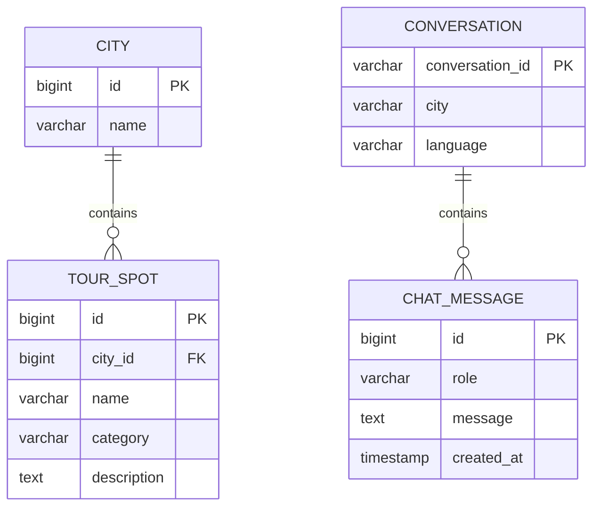

# 🗄 ERD

```mermaid
erDiagram

CITY ||--o{ TOUR_SPOT : contains
CONVERSATION ||--o{ CHAT_MESSAGE : contains

CITY{

bigint id PK

varchar name

}

TOUR_SPOT{

bigint id PK

bigint city_id FK

varchar name

varchar category

text description

}

CONVERSATION{

varchar conversation_id PK

varchar city

varchar language

}

CHAT_MESSAGE{

bigint id PK

varchar role

text message

timestamp created_at

}
```

---

## 설명

CITY

↓

관광지 관리

↓

대화 저장

↓

ChatMemory