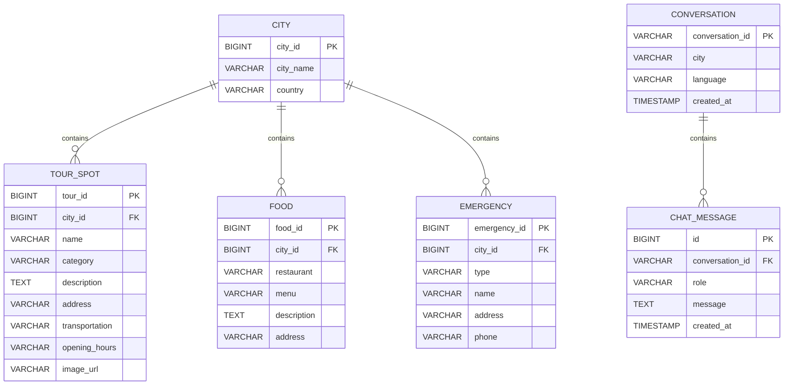

# 🗄 Database Design

# Database Overview

LocalMate AI는

도시별 관광 정보를 관리하고,

사용자와 AI의 대화를 저장하기 위한 구조를 가진다.

---

# ERD

---

# CITY

도시 관리

예)

- Busan

- Gyeongju

- Seoul

- Jeju

---

# TOUR_SPOT

관광지

예)

감천문화마을

불국사

첨성대

해운대

---

# FOOD

음식

예)

돼지국밥

밀면

한정식

---

# EMERGENCY

긴급상황

예)

병원

경찰서

영사관

약국

---

# CHAT_MESSAGE

ChatMemory 저장

role

- user

- assistant

---

# 확장 계획

Version2

서울

↓

Version3

제주

↓

Version4

전국

도시는

CITY 테이블만 추가하면 된다.